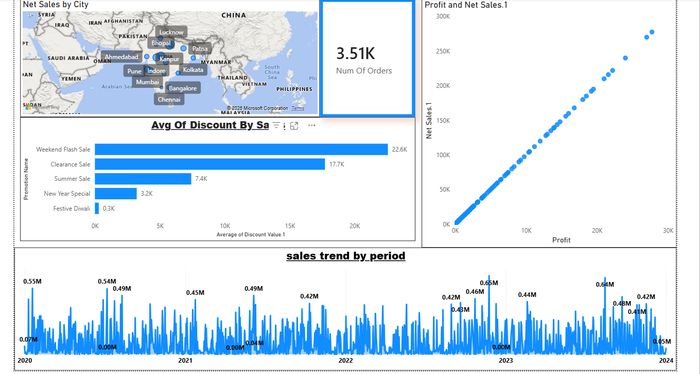

# Sales Data Analysis Dashboard — Power BI

An interactive Power BI dashboard built to analyze five years (2020–2024) of retail sales transactions, uncovering revenue trends, promotion effectiveness, and city-level performance to support data-driven business decisions.

## Business Problem

The business needed a clear, centralized view of its sales performance to answer key operational questions:
- Which cities and regions are driving the most revenue and order volume?
- Which promotions are generating disproportionate discounts without matching sales lift?
- How have sales trended over time, and where are the seasonal spikes and slumps?
- Is there a healthy, consistent relationship between profit and net sales across transactions?

Raw transactional data alone couldn't answer these questions — it needed to be modeled, cleaned, and visualized into an interactive tool that stakeholders could filter and explore on their own.

## Solution

I built a self-service Power BI dashboard on top of a properly modeled dataset, enabling stakeholders to filter by date, promotion, city, and product to explore sales performance without needing to write a single query.

### Data Modeling
- Designed a **Star Schema** data model with a central `Fact Table` (transactions: units sold, price, total sales, discount value, net sales, profit) connected to dimension tables — `Dim Customers`, `Dim Product`, and `Dim Promotion` — plus dedicated date tables for time intelligence.
- Cleaned and transformed raw data in **Power Query Editor**: data type conversions, filtering, and merging/appending queries from multiple source tables into a scalable model with correct cardinality relationships.

### DAX & Measures
- Built core DAX measures — `Sum Of Net Sales`, `Total Profit`, `Total Units Sold` — using functions like `SUM`, `CALCULATE`, and `RELATED`.
- Applied time intelligence functions to power dynamic sales trend analysis and date-range filtering across the report.

### Dashboard Visuals
- **Net Sales by City** — a map visual showing geographic distribution of orders and revenue across major cities (Mumbai, Bangalore, Kolkata, Indore, and others), alongside a total order count KPI card (3.51K orders).
- **Avg. Discount by Promotion** — a bar chart comparing average discount value across promotions (Weekend Flash Sale, Clearance Sale, Summer Sale, New Year Special, Festive Diwali).
- **Profit vs. Net Sales** — a scatter plot examining the relationship between profit and net sales per transaction.
- **Sales Trend by Period** — a time series chart of daily/period sales from 2020 to 2024, with annotated peaks and troughs.

## Key Insights Found

- **Weekend Flash Sale and Clearance Sale drove the highest average discounts** (22.6K and 17.7K respectively) — significantly higher than Festive Diwali (0.3K), flagging these promotions for a closer ROI review to ensure discount spend is translating into proportional sales gains.
- **Profit and Net Sales show a near-perfectly linear relationship**, indicating a consistent margin structure across transactions with no major outliers or pricing anomalies.
- **Sales trends reveal recurring seasonal spikes** (e.g., 0.55M and 0.54M peaks in 2020–2021, a 0.65M peak in 2023), useful for anticipating demand and planning inventory/promotions around historically strong periods.
- Order volume and net sales are concentrated in specific metro cities, highlighting where regional marketing and stock allocation could be prioritized.

## Tools & Technologies

| Category | Tools |
|---|---|
| Data Modeling & Transformation | Power BI (Power Query Editor) |
| Data Modeling Technique | Star Schema, Cardinality Management |
| Analysis | DAX (SUM, CALCULATE, RELATED, Time Intelligence) |
| Visualization | Power BI (Maps, Bar Charts, Scatter Plots, Time Series, KPI Cards, Slicers) |

## Dataset

The model is built around one **Fact Table** (sales transactions) and three **Dimension Tables**:
- `Fact Table` — Date, Customer ID, Promotion ID, Product ID, Units Sold, Price, Total Sales, Discount %, Discount Value, Net Sales, Profit, Order ID
- `Dim Customers` — Customer ID, Name, City, State, Pincode, Email, Phone
- `Dim Product` — Product ID, Product Name, Product Line, Price
- `Dim Promotion` — Promotion ID, Promotion Name, Ad Type, Coupon Code, Discount Percentage

## Files

- `sales_analysis_Dashboard.pbit` — Power BI template file (open in Power BI Desktop)
- `Dashboard_Sales_Analysis.png` — Dashboard screenshot
